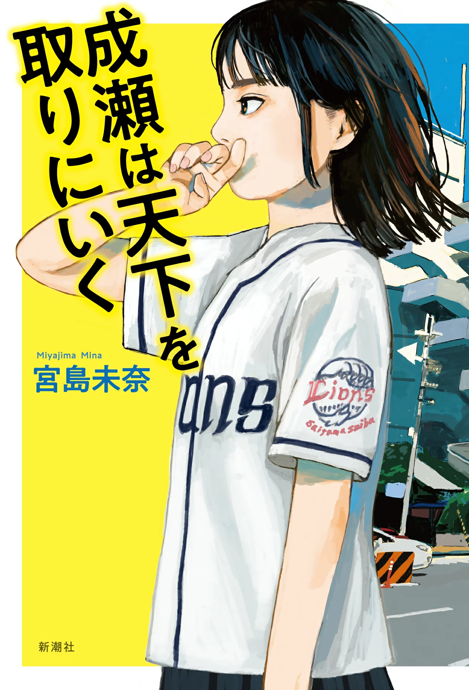

2025.12.10追記

M1の夏、今となってはいい思い出ですが、個人的に結構悔しかった思い出を残しておきます。
この後、ワークショップの運営補助を国内で行いましたが、いい経験になりました。
国際機関なんて大層なもんじゃない、とこの2年間で思えるようになったのは大きな成長だと思っています。

青臭い文章だけど、まぁ人間このくらいじゃないとね。

____________

自分の国際機関への公費留学の計画が頓挫したことを記しておきたい。

原子力工学という専門性と個性を武器に、選抜やら面接やら、もろもろをやり過ごして戦ってきたけれども、あと少しのところで「英語力の欠如」を理由として突然キャンセルされてしまった。
ビザを取りに大使館に行く手続きをキャンセルするのは、手が震えるくらい悔しかった。
わりとちゃんと落ち込んだ。
専門分野の知識を活かし、社会に貢献できる稀有な人材になる。
そのために行動したことだったからだ。
口では友人と酒飲んでたら30分くらいで忘れた、なんて言っていたけど、気持ちを消化するのに1か月はかかった。

「成瀬は天下を取りにいく」を読んだのは、吹っ切れているようでもやもやしている時だった。

> 成瀬が言うには、大きなことを百個言って、一つでも叶えたら、「あの人すごい」になるという。
> だから日ごろから口に出して種をまいておくことが重要なのだそうだ。

<small style="color: #888;">▲ 成瀬は天下を取りに行く p.9</small>

ぼくは何回も9ページのこの部分を読んだ。
二子玉のいけ好かないスターバックスで、Macをいじくるよくわからない人種の横で、本を読み終えた後もこの部分だけ何度も読んだ。

口だけは達者な自分は内心留学がキャンセルになったことを恥じていたが、それ以降やめることにした。

自分はその時点で出せる力を出し尽くした。
ベストを尽くした。まずそれでいい。

昨年その留学に行った人は筑駒出身からのエリート街道だそうで、自分より経歴はすごい。きっと自分の代わりに留学に行く英語ネイティブのヤツは英語がペラペラなんだろう。

別にいいじゃないか。
国際機関にふんぞり返っていようが、博士の学位を持っていようが、彼らが自分を評価してくれなくても。
自分には自分なりの翼の広げ方、胸の張り方がある。
稀有な人材になるうえで海外経験はマストではないからだ。

自分と他人を比較することもやめた。
例え自分以外の留学組が自分より専門性がなさそうに見えても、自分より明らかに英語が喋れなくても、自分より積極性が欠如しているように見えても人は人で、彼らにはできないことを自分がやってやればいいだけだからだ。

自分は留学に行けないからダメなやつなのか。
そんなことは決してないし、順調に留学を敢行した時には見えなかったであろう自分がいる。

高校生までの知の蓄積、学部以降の専門性、半社会人になって得た経験、自分の個性、積極性。

そこに海外経験がなくとも、正しい努力と行動をしていけば、自分は十分に「社会で稀有な人材」になれる。
成瀬が言ってくれた言葉になぞらえて、自分の将来に種を蒔いておきたい。

そのうえでこのホップ・ステップから次にどうジャンプするかを考える必要がある。

===
友人の紹介がきっかけで、お話しさせていただいた方から面白い話を伺った。
1万人に1人の人材になるには才能が必要だが、100人に1人の人材になるには勉強を1万時間くらいすればいいらしい。
つまり、2つの専門性を持ち合わせることで、凡人は1万人に1人の人材(≒稀有な人材)になれるらしい。

自分には専門性は原子力工学の1つしかないと思い込んでいた。
しかし、それは間違いだったように思える。
高々3年くらい勉強した内容で鼻高々に専門性だなんだの言うのではなく、これからもマジメに勉強し続けることで、複数の専門性を身に着けていきたいと、その話を聞いて考えた。

====

安定という言葉が嫌いだ。
「安定」なしに人の生活は語れないことはよく理解しているつもりだ。
「安定」した生活を送らせてくれた、いろんな人たちには頭が上がらない。

しかし、一般に安定という言葉の意味には、自分の可能性の幅や型を勝手に自分で決めつけるようなニュアンスが含まれている気がする。
なんでもない日常を蓄積することに主眼を置くことで、困難な問題に挑戦することや、失敗することから逃れようとするのは、面白くない。

人はその気になれば、なんにでもなれると信じている。
ただし、みんながみんな、「おかわりくん」になる必要は一切ない。
栗山選手でも、源田選手でも、外崎選手でも、平良選手でもいい。
大事なのは、目標目的に向けて、自分にできることは何かを考え、行動することだと思う。

「自分にしかできないこと」に挑戦するために、これからも日々いろんなことから学び、自分の人間像・可能性を広げていきたい。