## はじめに

この記事はTokyo City University Advent Calendar 2022の8日目の記事です。
そしてこの記事は肖像権の侵害が大いに含まれます。関係者各位は諦めてください。
(削除依頼は受け付けます。なんなりとお申し付けくださいませ。)

そして枕詞をぶっ壊すようだが、投稿予定だった記事を書かずにばっくれた2022年のアドカレから、なんと3年もの月日が経ってしまった。

3年という月日は長いものである。高校生が入学して卒業するまで。B1がB4になるまで。

そしてあの頃、輝いていたTwitter芸人のほとんどが就職し、今となっては彼らが生きてるのか死んでるのかもわからない状況になってしまった。

界隈に残っているのは、院へ入院したキチガイか、就職してもなお界隈に残り続ける強い意志を持ったキチガイか、同期として入学して後輩として卒業するキチガイのいずれかである。

みなさまお変わりないでしょうか？

今回、3年越しに記事を書こうと思ったきっかけは、なんとなくだ。

社会人になる前に、忘れてしまいそうだけど、忘れたくない、楽しかった課外活動の想い出を整理しておきたかったからかもしれない。

私が大学に入学してから6年間、都市大は様々な転機を乗り越えてきた。水没にコロナ禍、世田谷と等々力の合併。

ここでは私自身の学団連本部での活動を気持ち程度に触れながら、主に書きたいことを書いていく。

## 自己紹介
<figure>

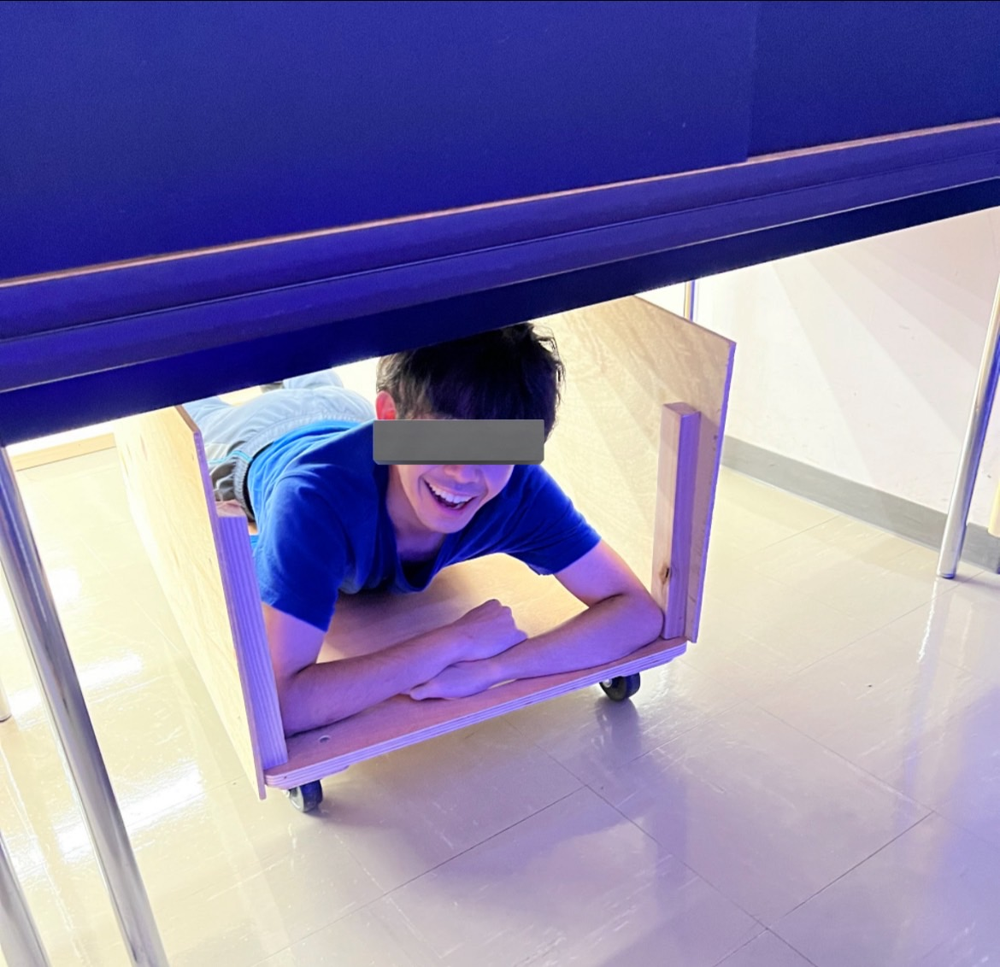

</figure>
学団連あたりで狂い叫んでました。

数々のやらかしは致死量に達してましたが、周りの優秀な方々のおかげでなんとか生きています。
感謝。

## 学生団体連合会とは？

ざっくり誤解を恐れずに説明するのであれば、大学と学生の架橋となる団体である。
友人を勧誘したとき、右とか左とかのやべー団体だと思われたみたいだけど、団員それぞれがクレイジーなだけで団体はやばくない。

<figure>

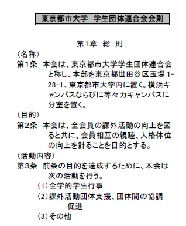　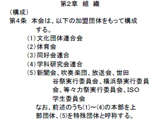

<figcaption>
  ▲ 学生団体連合会会則 課外活動手続きマニュアル2021から引用
</figcaption>
</figure>

活動内容としては、全学的学生行事の運営および運営支援、課外活動団体支援ということで、大きめの学生行事の主催および補助を行うことがメインとなる。

上部特殊団体の団体の一つであり、言ってしまえば彼らといかに強固な関係性を構築できるかどうかが、現役の間の時間の有益さを決定づける。

学生団体連合会本部HP
https://www.sto.tcu.ac.jp/

学生団体連合会横浜分室HP
https://yc-bunshitsu.jp/

ついでにtwitterも
https://x.com/sto_sc

私はこの団体にひょんなことから入団することとなるが、実に有意義な4年間を過ごすことができたのは、学団連のおかげだと心から思っている。

## 第一章　水没以後〜東京水没大学の隆盛〜

### 2019年多摩川氾濫、都市大被災

　私たちが大学に入学する一年前の夏、伝説に残る出来事が起こった。なんと都市大、水没。
<figure>

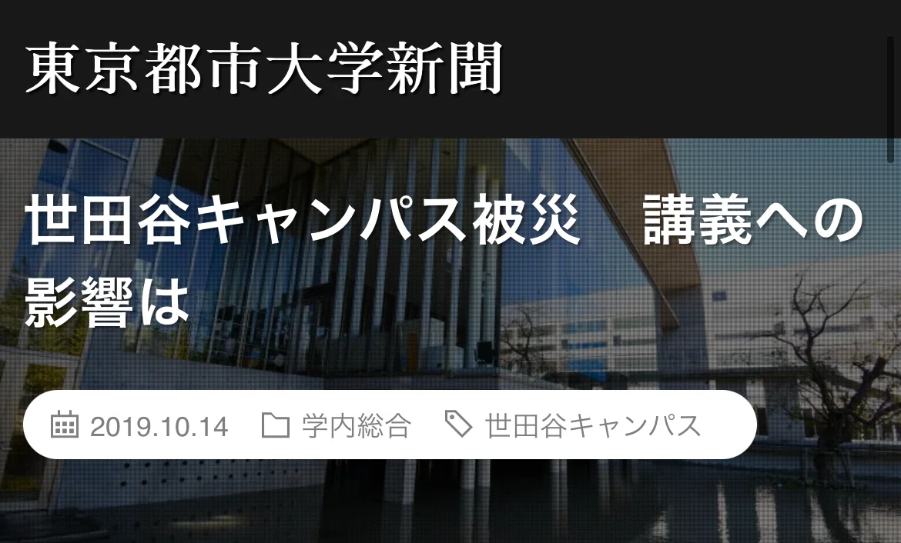

<figcaption>
  ▲ 都市大新聞会HPより引用 
</figcaption>
</figure>

https://tcuprs.com/2019/10/14/typhoon2/

水没することを予期した大学関係者が、土嚢で大学の入口を塞ぐも、当然その程度では水没を阻止できず、大学図書館の地下一階に所蔵されていた重要な書物・Macのデスクトップなどが犠牲になった。

結局、私たちが大学図書館の地下一階に入れるようになったのは、2022年ごろなので実質復旧まで4年近くかかったようである。やばすぎ

### 大学叩きで一挙躍動するツイッタラー

言ってしまえば、近くに多摩川が位置していることから、いつ氾濫が起こってもおかしくない状況、なんなら都市工学科（旧土木科）や建築学科が設置されているにもかかわらず、水没対策がなされていなかったわけである。一部の学生は大学への痛烈な批判をtwitter上で行っていたようだ。

それもそのはず、水没によって学祭・通常授業等が中止になったこともあり、批判の声があがることも無理がないと言える。

<figure>

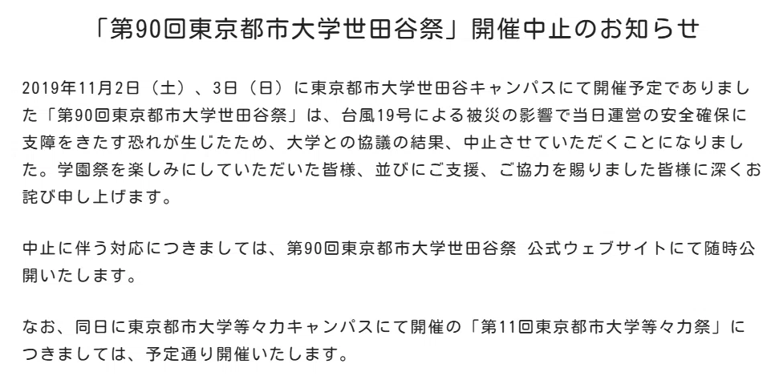

<figcaption>
  ▲ 世田谷祭開催中止のお知らせ | 第90回東京都市大学世田谷祭 
</figcaption>
</figure>

学生支援課を糾弾するためにツイッタラーが一致団結していたり、一部の過激派を狂人が叩いたり、はたまた四工大界隈の結束を強めようとしたり、各人が無茶苦茶なことをして、ネタにしてネタにされる時代。

現実で人と関わり合うことが希薄だった時代、でもTwitterでの悪ノリでまとまっていた人たちが観測できた時代。

<figure>

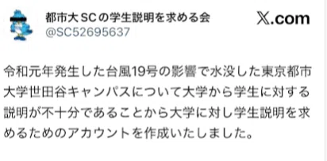
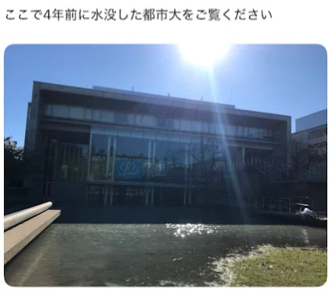
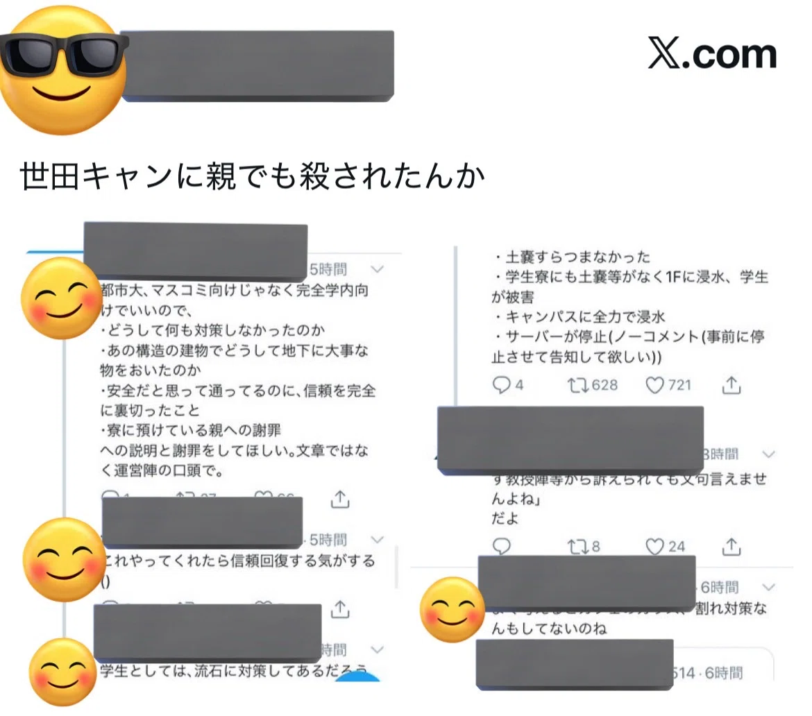
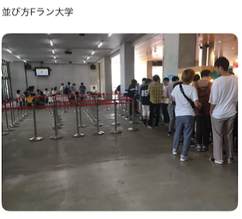

<figcaption>
  ▲ 悪ノリ？の様子
</figcaption>
</figure>

## 第二章　コロナ禍による制限と学生同士の自助

### オンラインが主戦場だったあの頃

ここまでTwitterの古き良き話をしてきた。全く学団連と関係ないじゃ無いか、と思われたかもしれない。

なんと、関係なく無いのである。

なぜなら、当時の課外活動の主戦場はオンラインだったからだ。

<figure>

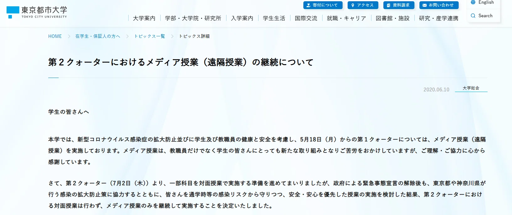

<figcaption>
  ▲ 第３クォーターにおける授業について｜東京都市大学
</figcaption>
</figure>

今となっては考えられない話だが、2020年の大学生活においてキャンパスを踏み入れた回数は健康診断と数回の実習だけで、多くの大学一年生が情報不足に喘いでいた。

学祭も横浜、世田谷ともに中止。新入生の歓迎会はおろか恒常的な活動すらも行えず、授業も課外活動も全てがオンライン開催になった。

私が大学に入学した2020年はコロナ禍も相まって、対面で人と接することができなかったため、twitterで交友関係を作るほかなかったことを鮮明に覚えている。

入学式に初々しくスーツを着て、桜の咲く花道で新歓のビラをもらう、なんて華々しい思い出もなかった自分にとって、諸先輩方や同期がtwitterで暴れている姿はやけに楽しそうに見えた。

### 学生、動きます

授業がオンラインになると、寝坊のリスクはなくなり、真面目に授業を聞いてなくても、ある程度良い点数が取れるようになる。~そのせいか、コロナ禍での成績評価は歴代最高だったなんて話も~

上級生とのコネクションのない大半の学生は情報をキャッチアップできず、オンライン上での歓迎会があることも今後の学生生活について相談できる対象がいなかったようだ。

ということで、主に情報系学部の学部2年以上の学生がTCU-VRSAという団体を立ち上げ、新入生のサポートをオンラインで行ってた。

さらに2021年に突入し、学団連とTCU-VRSAが共同で、TCU-Clubhouseという活動の勧誘をオンライン上（LINE）で行えるプラットフォームを作り、諸団体の勧誘活動のサポートを行っていた。

今となっては、TCU-VRSAの活動していた痕跡はGit hub上にしか残っていないが、これらの活動が慈善事業として行われたこと、活動していた人もコロナ禍による被害者だったことを考えると、先人は偉大である。

<figure>

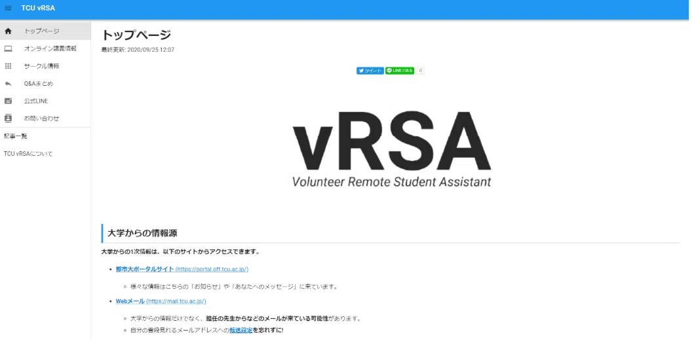

<figcaption>
  ▲ TCU-vRSAのHP (すでに非公開)
</figcaption>
</figure>

<figure>

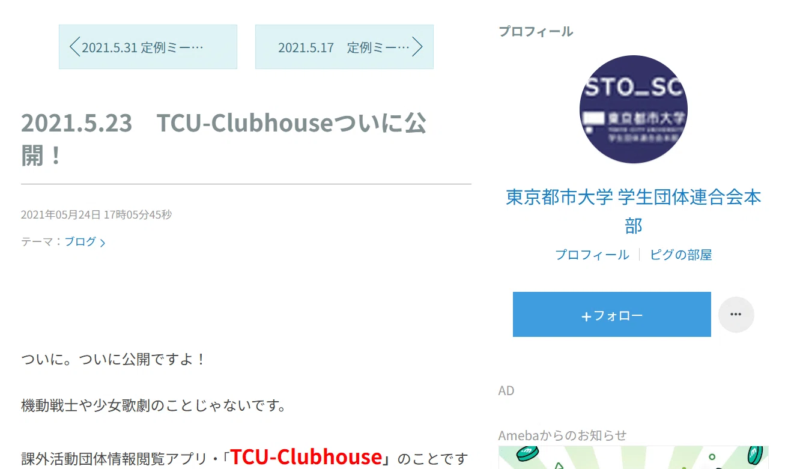

<figcaption>
  ▲ 2021.5.23　TCU-Clubhouseついに公開！ | 東京都市大学学生団体連合会本部
</figcaption>
</figure>
https://ameblo.jp/gakudanren-honbu/entry-12676440074.html

### FF内エンカ最盛期

私個人の話ですが、どうしようもなかったのでTwitterでお友達を作っていた。

学科の人だけじゃなく、他学科や他学部、世田谷キャンパスだけでなく横浜キャンパスの人と仲良くなれたことは後に活きてきたなぁ、と思うところである。

むしろ、学科の人よりも他学科の人と仲良くなれたことは、私にとってすごく有意義だった。
なんと、実に彼らの大半が課外活動団体に所属していたことから、学部三年生で、課外活動の復興を目指して、彼らと共闘することになる。
ゲキアツ。

当然、ネット上のつながりなので、合う人、合わない人はいる。
現実世界で声をあげられないマイノリティでも、ネットには居場所がある。
彼らの発言はある種正しい一方、快か不快かを判断するのは結局他人なのだ。
分かり合える人もいれば、分かり合えない人もいる。そんな当たり前なことを実感した。
だけど、彼らと騒いだり遊んだりした時間は、かけがえのない経験だなぁ、と思うばかりである。

私自身が本格的に学団連での活動を開始したのはちょうど2021年の秋ごろから、会計監査等のお手伝いをしてからだ。
K先輩がVRSA関係の仕事に追われているんだなぁ、程度に把握していただけだったが、実際のところはかなり大変だったろうなと思うばかりである。（先人はやはり偉大！）

そしてコロナの感染者数の減少に伴い、図らずも課外活動は対面開催への糸口をつかむことになり、完全オンライン野郎たちはアフターコロナへと歩みを進めることとなる。

## 第三章　そしてアフターコロナへ～杞憂に終わったキャンパス合併による衝突～

### 対面文化の再生と合併の追い風

話を戻して2021年にもなると、夏が終わり3Qあまりから対面での授業や課外活動が少しずつ行われるようになってきた。

しかし、横浜と世田谷での学祭はオンライン開催となり、課外活動の完全な対面活動もお預けになってしまった。
一方で、チャリティーフェスティバルといった企画が学団連YCによって行われるようになり、着々と課外活動は対面活動の再開に向かって歩みを進めていくこととなる。

一方で、今となっては大半の人が忘れているだろうが、多くの団体にとって大きな懸念になったのは世田谷キャンパスと等々力キャンパスの合併だろう。

一見、合併によって学生数が増えることが良いことのように思えるかもしれない。
が、現実は統合によりキャンパス間で幹部争いが勃発したり、キャンパス文化の違いによる団体内での衝突の顕在化を不安視する声が多かったように感じた。

2022年を迎え多くの課外活動団体がアフターコロナ後の課題として「自団体の復興」を掲げていたことと、ほとんどの構成員が普通の課外活動を知らない学生だったこともあり、新入生の勧誘は自団体の新たな船出として位置付けられていたように記憶している。

勧誘活動において大事なのは、質より量だ。ある意味、コロナ明けの課外活動団体にとって、キャンパス統合による団体の構成員の増加は追い風だったのかもしれない。

### 3年ぶりの対面イベント

学団連が主催したスプリングフェスティバルは、間違いなく課外活動の復興に一役買っていたと断言したい。開催者側の人間として、企画書作りから学生支援課との会議まで主導で関与し、なによりコロナ禍により停滞していた課外活動において3年ぶりの対面イベントを開催できたことを幸運に思う。

<figure>

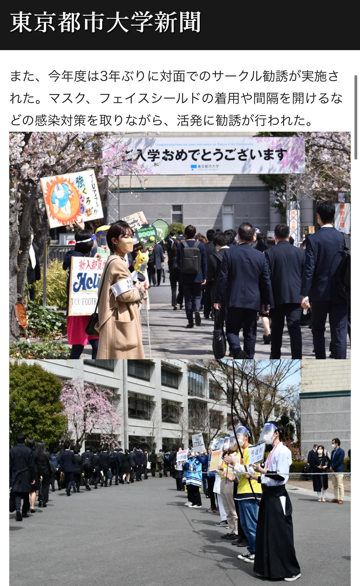

<figcaption>
  ▲ 新聞会HPより
  マスク・フェイスガードは着用必須、ソーシャルディスタンスも確保
</figcaption>
</figure>

https://tcuprs.com/2022/04/28/2022_entrance-ceremony/

スプリングフェスティバルは大盛況に終わり、その後続々と対面でのイベント開催が行われることとなる。

### コロナ禍だからこそ生まれた出会い

自分たちの代ほど団体を飛び越えた交流を経験した代はいないだろう。

2022年度に開催された対面イベントにおいて、それらはコロナ禍により活動が制限されてきたはずの多くの課外活動団体が協働することによって、全体像を作り上げられた。

私個人の意見だが、そのようなことは例年起こりえないことだった。

なぜそんなことが可能だったのかといえば、当時の長たちは２年間人数不足・活動できないといった状況に苦しめられたからこそ、困った時には団体同士助け合おうという姿勢が自然に構築されたからだと推察する。

同じコロナ禍で苦しんできた団体同士だからこそ、団体という壁を勝手に作ることなく、純粋に相手に興味を持ち、協働して一つのものを作り上げていける関係性が作りやすかったのかもしれない。

そしてもっと不思議なことに、このような協働の関係性が作りやすかったのは、彼らの大半とTwitterですでに面識があったことが非常に大きい。

ある意味、Twitterで知り合った学生同士の輪に、知り合っていく人たちを巻き込んで、我々は仲良くなったと言っても過言ではない。

<figure>

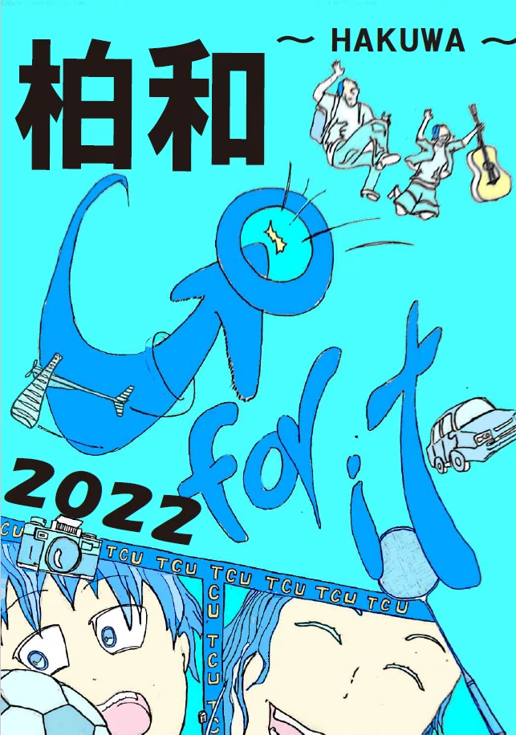

<figcaption>
  ▲ 課外活動団体を紹介する雑誌　柏和（かしわじゃないよ、はくわだよ）
</figcaption>
</figure>

### ト〇タ式「光る学費」のカイゼン

もう一つ自分たちの代で成し遂げたことを挙げるとすれば、「光る学費」のカイゼンだ。

もともとイルミネーションは先代が購入した物品が会室に保管されていたが、なんにせよ色が汚くてあまり感動しなかった。電気科の同僚に会計担当をお願いしていたのだが、ちょうど予算も余っているということで、派手に新品の良く光るイルミネーションを購入した。

これがファインプレイで、学祭期間にも乗じて学内を鮮やかに点灯させることができた。ここでのイルミの購入の判断はかなりよかった。

正直コロナ禍で鬱屈していた過去の自分たちが、大学内を鮮やかに光り輝かせるまでに、充実した活動ができるとは思っていなかった。達成感もあったし、在学生からもおおむね好評な意見を小耳にはさみ、非常に満足だった。

そして不思議なことに、イルミは引退後も我々と切っては切り離せない商売道具になっていく。

<figure>

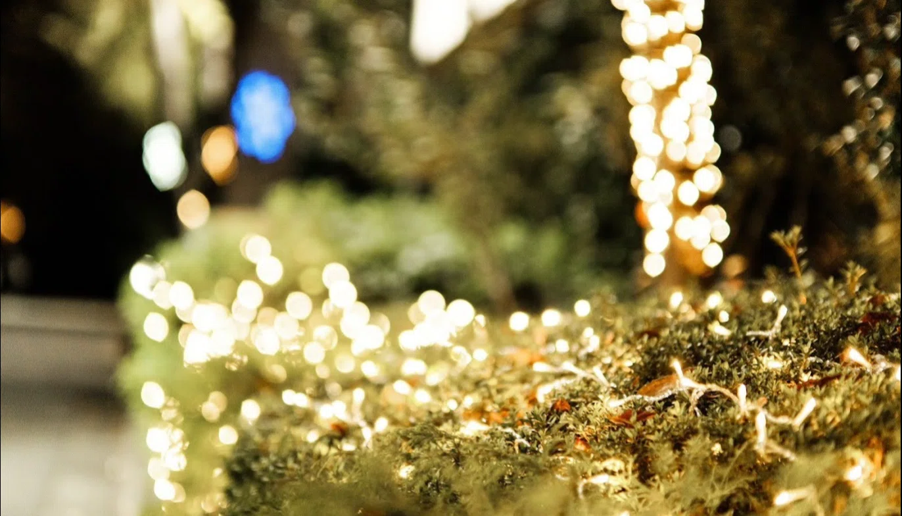

<figcaption>
  ▲ 学内のイルミネーション
</figcaption>
</figure>

## 第四章　引退のち老害？

引退するまで、誰かしらの誕生日を祝ったり、合宿という名ばかりでみんなで浜名湖や日光に遊びに行ったのはいい思い出だ。

不思議なことに、引退してから（むしろ）そういったイベントに頭を突っ込むことが多くなった。

学年や団体を問わず、純粋に相手に興味を持ち、他者を喜ばせようとする人が私の周りには多かった。
そして、彼らの大半が常識にとらわれずに、やれそうなことにはとことんチャレンジする精神の持ち主だ。
イルミネーションもそうだし、ベイブレードのパーツをを学内の工作室で作ったり、「行政」と称して教室内にプラレール等を並べて街を作り出すなんて、正気の人間には到底できることではない。

そのような人たちとのめぐりあわせで、私の大学４年間はより鮮やかなものになったし、濃く思い出に残っている出来事は大抵普通じゃ起こりえないクレイジーなことばかりだ。

<figure>

<figcaption>
  ▲ 放送会とキャンプ　大学だけでなくテントも水没した
</figcaption>
</figure>

<figure>

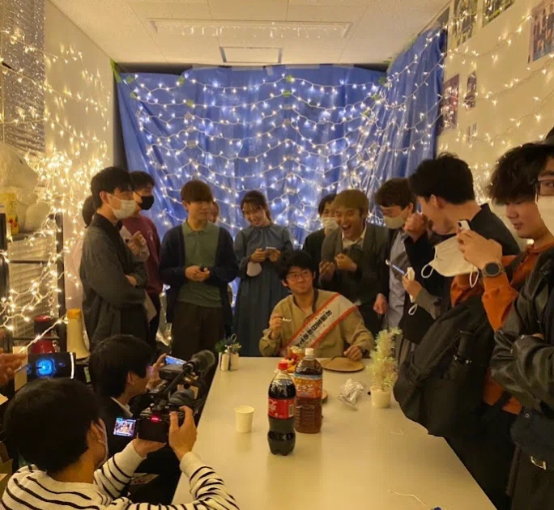

</figure>

<figure>

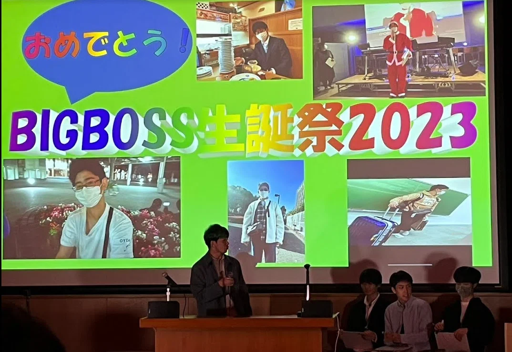

<figcaption>
  ▲ BIGBOSSは今何処へ？
</figcaption>
</figure>

<figure>

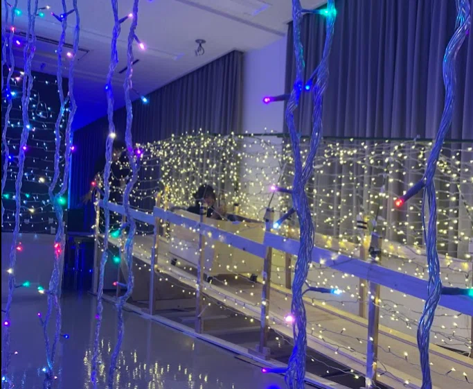

<figcaption>
  ▲ ジェットコースター×イルミネーション
</figcaption>
</figure>

<figure>

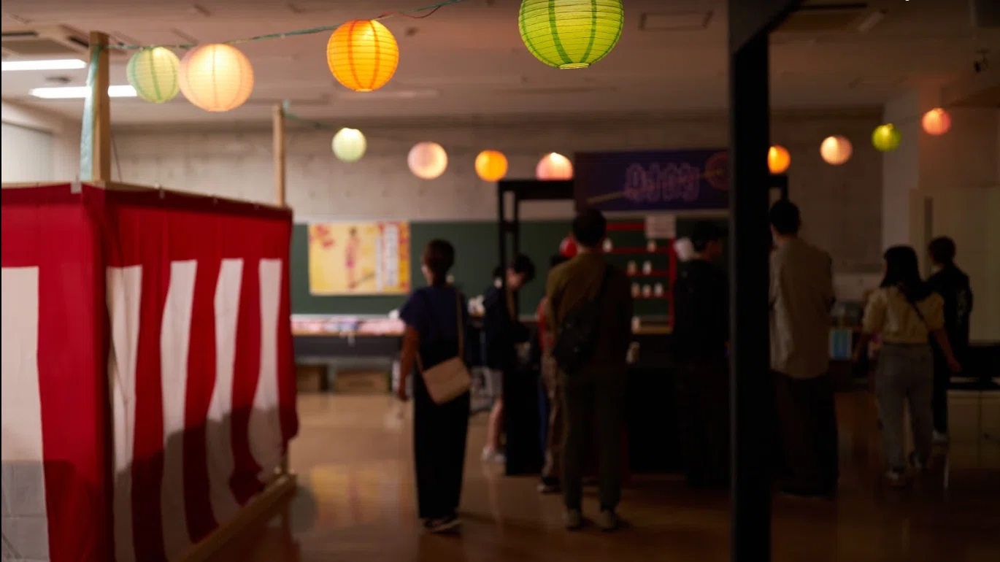

<figcaption>
  ▲ 黒歴史
</figcaption>
</figure>

一方で好き勝手やり過ぎることは、現役世代の邪魔をすることにもつながりかねない。
私の場合、普通に現役に迷惑をかけていたので、うまくごまかすのに加担してくれた同期・後輩の皆様に感謝したい。
でも多分ごまかせてないよな～ごめんなさい

そしていまだに仲良くしてくれててありがとう。

## 最後に～コロナ禍から生まれたシナジー～

2022~2025年にかけて、なんだかんだ毎年世田谷祭にはお邪魔している。
思うのは、僕らが現役だったころに比べて、所属している人たちが華やかだなぁということだ。

コロナ禍が終わって、復興のその先へ大学も課外活動も元通りになったことは純粋に喜ぶべき事項だ。

よくコロナ禍で大変だったね、かわいそうに、と声をかけられる。
確かに大変だった。対面文化のことはよくわかんないし、人も少なかったし、どうやって活動すればいいのかもわからなかった。

だけど、あの4年間は少なくとも自分たちにしか過ごせない時間だった。

コロナ禍という圧倒的逆境の最中に、わざわざ苦汁を飲むはめになっても、復興に向けて同じ団体・同じ行事に携わり、一緒に暴れた仲間との思い出は絶対に忘れない。

この記事を締めくくるにあたって、全ての出会いに感謝したい。ありがとう。

<figure>

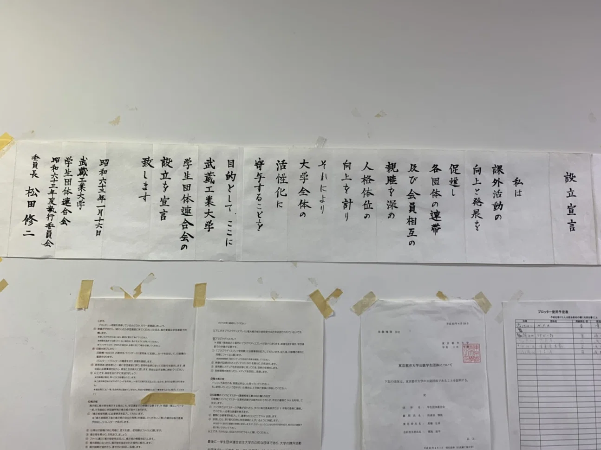

</figure>

 
Tokyo City University Advent Calendar2022の10日目の記事は、ノノノノさんの「面白い事なんて言えないので」です。 
3年越しのバトンタッチなんて、多分人生で初めて

https://note.com/no_tcu_no/n/ne47fbbda8547