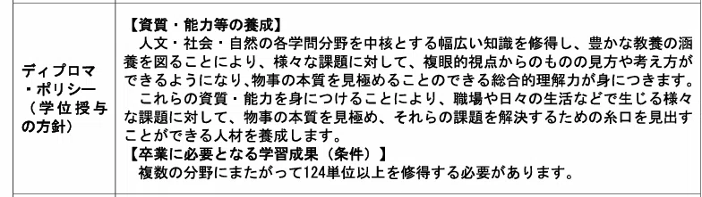
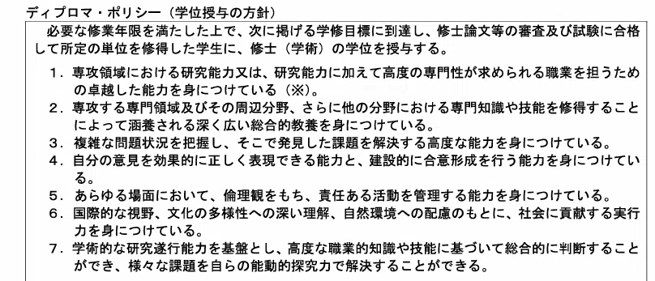
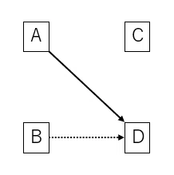
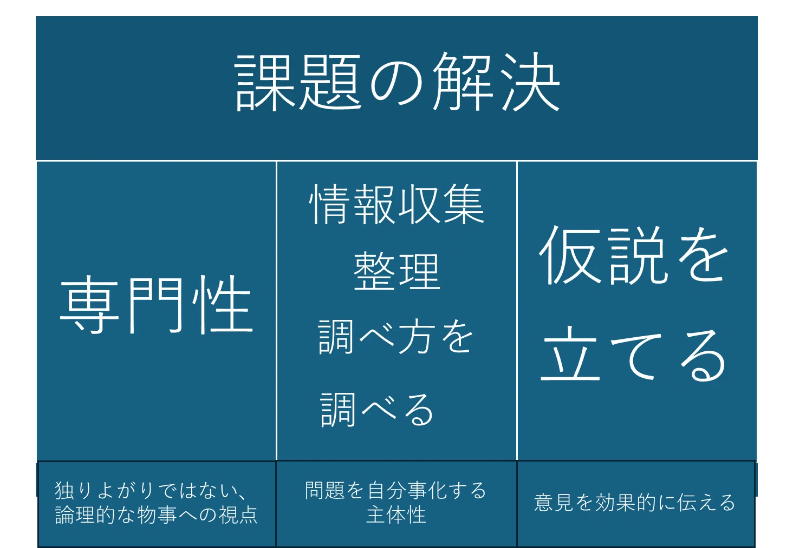

この記事はTokyo City University 裏Advent Calendar 2025の15日目の記事です。
https://adventar.org/calendars/11519

## はじめに

修士課程の到達目標とは何なのだろう。というのも、我々修士課程修了「見込み」の学生は、すでに2年社会で働いている学部卒の同期に対して何らかの差別化を行わないといけない。

すでに2年も現場経験を積んでいる、かつての同期であった彼らに対して、院卒ひよっこ社会人はどういった側面で勝負をしていくべきなのかを考えてみたい。

## 学士課程・修士課程の違いとは

まず、学士課程と修士課程の違いに注目していきたい。放送大学の学士・修士課程における学位授与の方針を読み解き、それぞれの教育目標を検討する。
<figure>

</figure>

放送大学のホームページより引用

放送大学において、学士卒の目安は「幅広い教養と複数の立場からの視点を持ち、物事の本質を理解し課題を解決するための糸口を見いだせる人材」であり、修士卒は「専門分野周辺の知識を用いて、現場の課題を発見・解決し、そのプロセスを建設的に他者に提示できる人材」になることが目安のようだ。

つまり学士と修士の決定的な違いは以下の3点ということが読み取れる。

①「幅広い教養」vs.「高い専門性」②「課題解決の糸口を掴む」vs「課題を解決するための具体的な行動」③「豊かな教養による複数の視点」vs「学際的な研究遂行能力を基盤とする総合的な判断」

修士課程の2年間はどの学生も基本的に所属する研究室で研究活動を行う。そこで培われた知識および経験は大抵、自分の研究の「テーマ」に関連していることから、修士卒の大きな武器の一つは「高い専門性」ということだ。

しかし、専門性をただ持っているだけでは意味がない、とディプロマポリシーは訴えかけている。その2年で培われた「専門性」を「基盤とした総合的な判断」によって「自らが発見した課題解決に向けて具体的な行動」を行えとまで要求する。

どうやら社会で実際に発生している多くの問題に対して、解決策を提示して行動まで起こせる人材の創出というのが修士課程の到達目標だ、とでも言いたいらしい。

①「高い専門性」は分かる。しかし、②③についてはむむ、これはなかなか難しいというのが学生の本音だ。正直なところ、それらができるようになるのは中堅社会人の時点が関の山で、我々はもっと手前側に位置している。

では、修士課程の院生が行っている研究活動のどのような事項が、課題解決・研究遂行能力に基づく総合的判断といった差異を生み出すと期待されているのか。

## 課題解決とは

大抵、世の中で「課題」と見なされているものには正解がない。

だから「仮説を立てる」ことが重視されているはずだ。研究活動でも仮説を立てる。

Dという結果を求めているとする。研究では多くの場合、Dという結果のためにAという手法を用いた場合と、Dという結果のためにBという手法を用いた場合を比較し、A→Dがいいのではないかと仮説を立てる。
<figure>

</figure>
その仮説を検証するためには論理的な思考力が必要だし、専門的な知識も用いることで実験や調査といった検証を行い、最終的な結論を導き出す。

社会において、修士卒人材は「仮説を立て、専門性を活かして検証を行う」ことが期待されている。

## 仮説を立てることの難しさ

仮説を立てることは難しい。なぜA→Dがいいの？B→Dの手法の方がいいじゃん、と言われて「確かに」と言ってしまえば、自分の研究の意味はなくなるからだ。

ここで、対抗技術を理解し、双方の利点を挙げたうえで、Aという方法の優位性を主張できなければ、仮に検証を行ったとしても、その正しさを主張することが難しい。

きっと学会や大学で派閥ができるのは、「Aという手法が優位だ」「Ｄという手法はダメだ」ということを主張しあって、お互いを守り合う関係性がはびこっているからなのだろう。そんな派閥と関わるのはごめんだが、とりあえず人生経験として遠目で眺めてみるのはいい経験ではなかろうか。

とにかく、世の中の曖昧な悩みを「解くべき具体的な課題」に分解して、解決に向けた道筋を考え実行に落とすことが、我々に期待されているらしい。

## 自分で情報を収集し、整理する

「これがわからないんですけど、どうすればいいですか？」と質問してくるヤツはまだまだで、「この課題のここまでは分かったんだけど、それがそうなるのは分かったんですけど、どうしてこれになるのか分からなくて。。。」と質問できるヤツは見込みがあるなんて話はよく出てくる。具体的な課題が判明したときに、今どこまで進んでいて、どこでつまずいているのかを客観的に把握して調べられる人間は、物事を推進するうえで重要だということだろう。

これはどちらかというと、主体性のおはなしな気がする。どれだけ課題に対して「これはじぶんごとだ」と思えて、問題点を整理する姿勢があるのか。どれだけ「出る杭になって」問題を解決に向けて推進できるかが試される。

<figure>

</figure>

## 問題はややこしくなっている

当然なことで、人間は生きている時代それぞれで各人のベストを尽くしているはずだ。にもかかわらず問題が山積なのは、時代が進むにつれて問題がややこしくなっているからだ。

技術は人を豊かにすると同時に、今まで無視されてきた問題を浮き彫りにする。それは具体的な目に見える問題というよりかは、目に見えない価値観だとか風習だとか、そういう問題であることが多い。

だから、自分たちが生きているうちに問題を全て解決するなんてつもりでなく、問題を解決に向けて、我慢強く前進させる心意気が必要なのかもしれない。

## 最後に AIと共存共栄するために

近年、アメリカではAIの台頭により会計士よりも配管工事士のほうが年収が3倍高いなんてこともあり、専門性のリスキリングが流行している。我々も同様、修士までの専門性に固執することなく、AIにはこなせない仕事とはなんなのか、AIに代替不可能な人材とはどのような人材なのかを日々考えながら生きていかなければならないなと思うばかりである。

 
Tokyo City University 裏Advent Calendar2025の16日目の記事は、れんぽよさんの「裏」です。 
2025年はなんとかタイムラグなしで繋げたかな