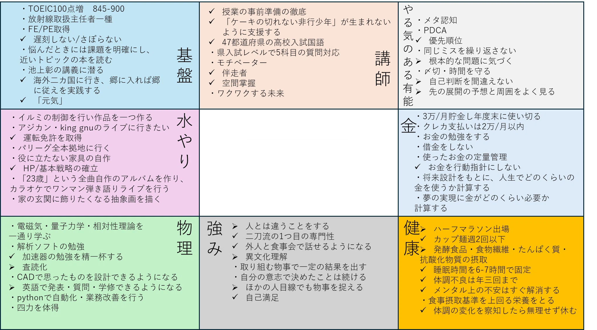

早くも2025年が終わろうとしている。
毎年その年の目標を立ててはいるが、なかなかうまくいかない。
立てた目標一覧を見て、どうしたものかと頭を抱えながら紅白歌合戦は後半戦に突入した。

ビールを二杯飲んだだけなのに、何やら感受性が高まっているらしい。
ステージ下方に残っている機材やアイドルを映さないように、ステージ上方のメンズアイドルを拡大していた紅白のカメラワークを見て泣きそうになった。 

あとやなせたかしとRADWINPSの歌詞が響き過ぎた。
「正解」がいいのは、年を経るにつれて人生における答えのない問いが顕在化してくるからでもあり、「自分が出す解答も採点基準も回答用紙も、すべては自分の人生次第である」というレトリックが、普段探しているつもりでも忘れがちな問いを苦しいまでに突き付けてくれるからなのかな。

とにかく、一年の締めである最大のエンタメショーであれば、最高の下準備がなされなければならない。カメラワークも台本も時間管理も徹底されており、毎年OPや予想外の展開が準備されているあたり、紅白は未だに最高のエンタメだと思う。

<figure>

<figcaption>
  ▲ 2025年の目標
</figcaption>
</figure>

今年の目標達成率は50%程度だろうか。
この目標を立てたときに考えていたことは、自分の持ち味である元気さを維持すると同時に、元気さとは逆の要素を自身に取り入れたいなといったことだ。うまく物事を進めるためのしたたかさ・計画性・推進力といった実務ベースの物から、海外経験・中学の頃は分かりえなかった芸術観などなど。

結論から言えば、あまりうまくいかなかった。
やろうとしていたイルミ・音楽・芸術系の趣味なんて、修論が書き終わらないとできるわけないのに、去年の自分は何を考えていたのだろうか。一方、運がいいことに海外経験は多く積むことができた。卒業旅行を前にして、学修関係で二カ国(四カ国？)を訪れられたのはラッキーだったし、今の自分では思想とか深い話を英語で出来ないなぁと実感した。
「異文化交流」の難しさの壁は高く大きい。

とはいえ、計画したプランの推進力は今後求められていくところであり、今後も継続して今の自分にはない要素を取り入れるような努力をしていく。

来年からについて。
恐らく生活様式も、環境も、やることも結構変わると思う。

基本方針は、**「環境のために変化せず、自分のために変化する」**ことだ。 

まず、仕事はやらされるものではない。 

**人生9回裏の物理的安寧のために、人生の大半で嫌なことをするなんて馬鹿げているからだ。** 

人生に「平均値」を持ち出して物事を語る人がとても多いが、**人生に平均値なんて存在しないはずだ。** 

平均寿命を見て80歳まで生きるつもりなのかもしれないが、人はいつ死ぬか分からないし、どんな目に遭うかわかりっこない。

自分は明日死ぬかもしれないし、当たり前の日常は突然終わるかもしれない。それは仕方ないことだ。 

**人生はカオスなのだ。**

だからこそ、常に現状を最高なものにしていきたい。
もっと面白い自分、もっとすごいこと、もっと興味深い物事に遭遇できそうな気配がしたら、迷わずに飛び込みたい。
人生の4回裏、1-0で自分がリードしているとしても、残りの5回で守備固めをして継投を使い切って一点を守り切るようなプレーはしたくない。

もちろんうまくいかないこととか苦しいことがあり現状維持に徹するときもあるだろうが、そもそも成長もせず変化もせず、かたい殻に閉じこもった自分自身にはワクワクしない。

**人生は自分が楽しみ、偶然出会うことができた周りの人たちとハッピーになれるようなことを一緒にやることに意義があると思っている。**

仕事は「周りの人たち」の絶対数を増やし、自分の行動でより多くの人たちのハッピーに貢献できる可能性を提供してくれる手段であり、目的は一度限りの人生を楽しむことにある。。
（無論、仕事がそんなに一朝一夕で身に付くものだとは思っていない）

仕事が「やらなきゃいけないもの」になってしまえば、僕の人生の中における仕事の意味合いは失われるだろう。
だから「環境のために変化せず、自分のために変化する」。

周りに合わせて顔色を伺いながら自分を変えるのではない。新しい環境で、今まで見たことのないもの、経験したことのないことを経験して、どんな面白いことがあるかを学ぶ。そのうえで、自分をどう変化させていきたいかを考えてワクワクできる自分でありたい。

来年の自分への抱負はこんなもんだろう。
まずは修論とプロシーディングを頑張って書きます。
この文章を読んでくれたあなたにとっても、2026年が良い一年でありますように！
良いお年を。