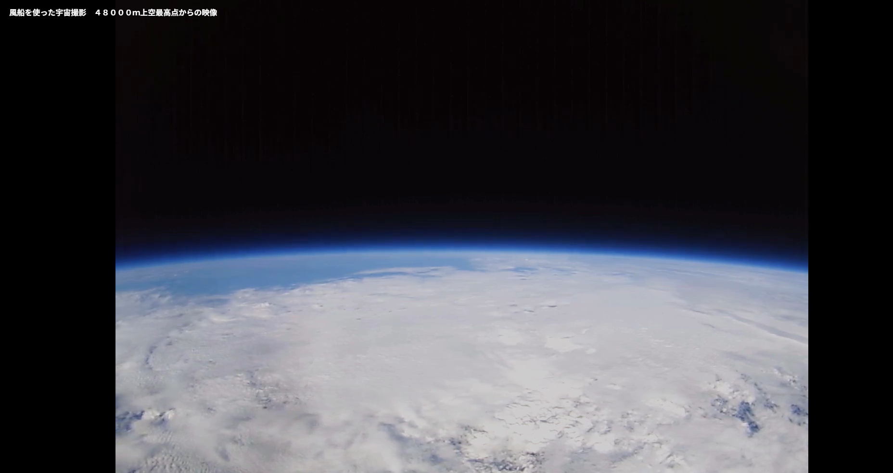

2月中旬、途方に暮れた。
5年取り組んだ集団塾講師の最終授業と修論執筆・発表が同時に終わったからだ。
無になった。不思議な感覚だった。そしてそれ以降の他愛もない予定に救われた。
友人の家に転がり込み勝手に風呂に入る、卒業旅行に行きしゃべれない英語を話す、3年間関わった生徒の合格発表に立ち会う、講師時代の同僚とサッカー観戦に行く、などなど。

3月初旬、やや降りの雨を見ながら春を感じている。
きっと友人たちもそれぞれの春を迎えているんだろう。
何かしらの環境の変化を控える年度末の春は、なにかしらノスタルジックな雰囲気が漂う。哀愁と期待がぐるぐる胸の底で混ざり合う感じ、そして故郷の山に不揃いに混じっていた桜を思い出す。
この燃え尽きの感覚は課外活動をしていたときのそれとは性質が異なる。
大学受験を終えたときと性質が似ているような気がした。

高校時代、きっと自分の人生はこれ以上広がらないと漠然と思っていた。
文化祭のコーヒーカップ、シーソー作り、課外活動、定期試験、E組とそれを取り巻く教師、友人、部活の先輩後輩で完結していた世界。

それから6年、世界は異様なほどの広がりを見せた。
色々な場所に赴き、色々な人と出会い、色々な経験を幸運にも積むことができた。
その経験は自分の内面的な世界を広げてくれた。
ひたすら内面的な世界にこもり孤独に考える事と、その内面的な世界を整理したうえで考えを他者にぶつけ、【じぶん】のかたちをどんどん変えていくことが同じくらい大切なことだと気づいた。
無論、誰とでも内面をぶつけ合うことなどできない。本音と建て前でこの世は作られていて、みんな予防線を張っている。その国境線を越えることは大抵相手を不快にさせるし、自分のエネルギーも消費する。

ところで、この文章を書きながらいきものがかりのyellを聞いていた。中学の合唱で歌ったのも懐かしいものだ。歌詞の一節にこんな詩がある。
*飛び立つよ　独りで　未来(つぎ)の空へ*
つぎの空というのはつぎの進路のこと。
中学生でいう高校で、高校生でいう大学なんだろう。
院生でいうつぎの空はなにかといったら、それは社会しかない。
すると教育機関からの離別といった意味で、もう「卒業」が人生にやってこないのは不思議な感覚だ。今後の人生でぼくは、何からも「卒業」しない。(社会からドロップアウトしない限りは。)
にもかかわらず、**これからも「卒業」ソングを聞いて感傷に浸れるのだとすれば、それはギャグだろう。**

ふと「卒業」とは世間における意味なのだと思った。
卒業・修了と中退・除籍の間には距離がある。
教育機関のカリキュラムは、多少形骸化しているにしろ、社会で活躍できる人材の育成のために作られている。卒業とは、カリキュラムで策定した事柄を修得し、ある程度の信頼性を担保した人材の輩出を意味する。意味のある事だからこそ、ある教育課程から卒業することは尊いこととされているし、「何者か」になるために我々は学んできた。しかし、この世は会社に属することだけで、「何者か」になれるほど虫の良い世界ではない。
そして、嬉しいことか悲しいことか、これからの人生において「何者かになりたい自分」に策定されるカリキュラムなんてない。会社が作ったカリキュラムは、日々会社に勤めることであたかも進歩しているか感を演出するために作られたものである。「何者かになりたい自分」の自己実現とは全く関係ない。
むしろ、会社に属してから、自分の専門性をどう広げ、どの分野を選んでいくかが、停滞することが予期される30代、40代以降を楽しくハードに過ごすための鍵なのではないか。

唐突なようだが、「卒業」は人生の終わりを意味する。人生の終わりというのは、「何者か」になるために、平均的な人生にさよならすることだ。平均的な人生が存在するとでも思っているのであれば見上げたものだ。人生は文字通りカオスだ。**寿命も身長も、性別もルックスも生まれた場所だって、どれ一つとして自分で選択してもいないのに、必死に世の中の平均の枠内に入るために「平均」を我が物顔で語っているのもギャグだろう。**
平均の枠内に入ろうとすることの弊害の例として内定ブルーが挙げられる。
就職先が確定すると自分も含む多くの人は、人生の進む方向がおおかた決められたレールのようなものが敷き詰められた感じがするのだ。しかし実際には人生にレールなど存在しない。このレールはいったい何なのか。

このレールは【これからの人生で応えねばならない周りからの期待】を意味するのだと思う。**自分自身の自分への期待にすら応えられていないのに**、なんで他人の期待に応えようとするのか。なんで他人が自分の期待に応えてくれるとでも思うのか。
他人と自分を比べようとすると、なんだか自分が孤独のように感じたり、不幸だなと感じたりする。だけど、どれだけ熱心に慮ろうが、自分以外の他人をコントロールすることも、本当の内面や心情も知ることができないぼくたちは、人と比較するまでもなくずっと孤独だ。みな一人残らずいつか死ぬし、こんなに必死に生きていたとしても、1人の人間ができることには恐らく下限とともに上限がある。人生はカオスだ。だからこそ、カオスを楽しもうとする姿勢、カオスの中でも生きていける基礎体力が必要になる。

ムラ社会の伝統がDNAに刻まれているのか、日本人は常に周りからの目線を気にする。時に自分のやりたいことでなく、みんなが納得する選択をすることがある。または自分のやりたいことがわからないから、周りからの期待に応えることをよきこととする。
もし、どこぞの知らん他人からの期待に応えるためだけに自分の今後の人生をささげるのだとすれば、なんてぼくたちの生きる人生はつまらないのだろう。21世紀が始まってから四半世紀が過ぎたにもかかわらず、未だに封建的な制度を享受し、望まれた通りのからっぽの自分を演じることが人生なら、そんな人生はクソだ。

教育機関からの卒業を控える今、人生は終わった。人生が終わることは悲しいことではない。自由への第一歩だ。(他人が期待するような自分の)人生が終わったということは、応えたいと思った期待にだけ応えるといった選択をするということだ。応える必要がないと思った他者からの期待を無視してもいいということだ。与えられたカリキュラムがない分、自分でやりたいことの実現への道筋を考えて行動すればいいということだ。

ここではやりたいことを見つけることが最も重要で難しいことだ。
やりたいことに利益なんて関係ない。今までの人生を振り返ったときに、自分が好きなこと、ワクワクすることがやりたいことだ。過去経験したことだけでなく、興味の湧くものをこれからの人生をかけて探せばいい。

ぼくが今ワクワクしているものはいくつかある。
興味のある順番で言ったら、宇宙・建築・旅・イルミネーションだ。

宇宙に興味を持ったのはほんとに最近のこと。修論がやばいときに、気分転換に西小山の温泉に行ったとき、なんとなく宇宙兄弟を読んだ。その日だけで15巻読むくらいにはドはまりした。別に地球以外の惑星に行きたいわけではない。ただ、未知がいっぱい広がっている部分に少し触れてみたいという好奇心からだ。また、アメリカの大学生や日本のベンチャー企業が気球でカメラを飛ばしたりして、宇宙から撮った地球の写真を見た。
**言葉を失うくらいきれいだった。**我々は一時代を生きただけで、教科書の一文にすらなれないし、歴史は繰り返すという言葉だけで表現されそうなトランプ2.0をはじめとする争い、やるせないニュースが社会にはありふれている。しかし、そんな社会を惑星として捉えて俯瞰してみると、分断も国境もなく、ちっぽけな人間を差し置いたほんとうに奇麗な青い星なのだな、と感動してしまった。

https://youtu.be/gVaDndHetxY

今年は宇宙にカメラを飛ばしてみたい。特に理由も利益もなく、ただ興奮するから。
今年度挑戦したいことはまた整理する。
